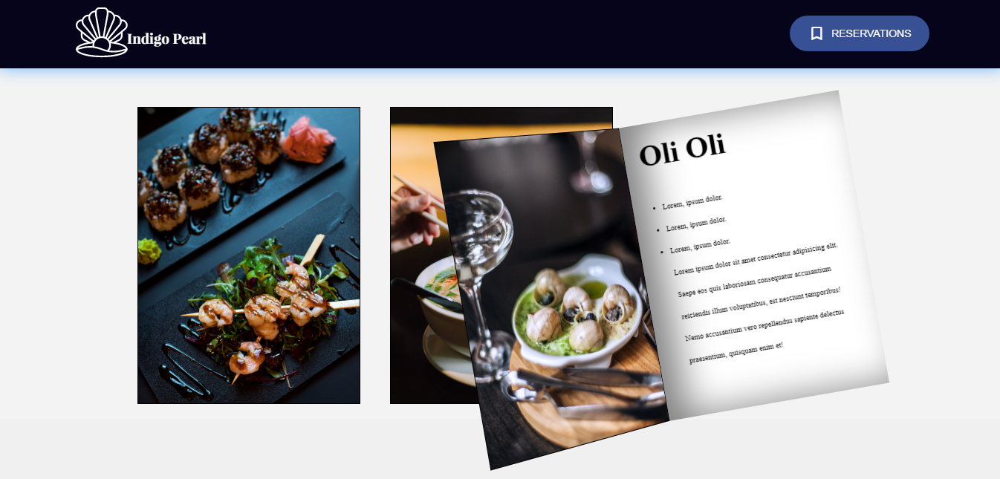

# Restaurant-website "Indigo Pearl"
## About 
This is my original design idea for abstract seafood restaurant.

Live version: https://yanakharlamova.github.io/Restaurant-website.github.io/

## Features:

* animated details (buttons, virtual menu, features` section cards);
* separated area-blocks with different useful information;
* responsive design for large, medium, small devices.
## Built with:
* HTML
* CSS
* SCSS
* JS
* BEM

  "7-1" pattern was also used  
## Application Sass structure:

## Installing
In order to run this code, run this commands in your project terminal:

**1)** `npm install` - to install project dependencies in the local node_modules folder;

**2)** `npm run sass` - to run the project.
## Screenshots:
**1.**

**2.**

**3.**

**4.**

**5.**

**6.**

**7.**

